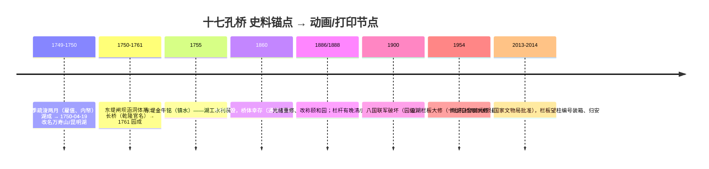

# 研究线 A：十七孔桥直接史料（research-m22-A）

- 项目：E30 十七孔桥「逐石建造动画 + 1:50 全深真砌体 3D 打印」
- 任务：乾隆朝建桥直接记载 / 形制一手数据 / 历次修缮 / 样式雷图档存目 / 光绪重修
- 检索日期：2026-10-06
- 方法：web_search 多轮 + 直接读原文页核对逐字（维基文库四库本、国图出版社官方页、京华时报/中新网全文、北京日报颐和园官方号）。搜索引擎 AI 摘要一律不作引文依据，凡引用均经原文页面直核。
- 置信级定义：**一手档案/一手出版物**（官修史籍原文、当事机构出版物与官方页原文）＞**学术论文/专家意见**＞**权威科普**（官方机构网站、官媒、当事机构回应）＞**一般网络**。两源冲突双录并注明取舍。

---

## 一、乾隆朝建桥直接记载（问题 1）

### [A1] 乾隆十五年三月丙辰（1750-04-19）改名谕旨是建园工程系年的最直接官方文献
- **结论**：《清高宗实录》载乾隆十五年三月丙辰谕旨改瓮山/金海之名为万寿山/昆明湖，即清漪园（含东堤、长桥在内）营建工程的纪年锚点。
- **引文**：「乾隆十五年三月丙辰（1750年4月19日），皇帝先后到了畅春园和圆明园，并颁布谕旨：『瓮山著称名万寿山，金海著称名昆明湖，应通行晓谕中外知之。』」（文章为颐和园研究室撰写、颐和园官方号发布）
- **来源**：北京日报·北京号《颐和学术｜昆明湖——长河水系的历史探源》（颐和园官方发布），https://peking.bjd.com.cn/content/s60bd86bae4b09695306d5d91.html
- **置信级**：权威科普（颐和园官方转《清高宗实录》；实录原卷次未直核）
- **工程含义**：动画时间线以 1750-04-19 为「湖成名定」节点；桥属该年动工的湖工-堤工-桥工序列。

### [A2] 《日下旧闻考》卷八十四：乾隆十五年建寺、命名、导水、设水师战船（官修史志一手记载）
- **结论**：官修《钦定日下旧闻考》（四库本）卷八十四明确记载乾隆十五年于瓮山建大报恩延寿寺、命名万寿山、汇诸泉易名昆明湖，并设战船按期水操——清漪园湖工为「水利+园林+武备」一体工程。
- **引文**：「今上乾隆十五年于其地建大报恩延寿寺命名万寿山并疏导玉泉诸派汇于西湖易名曰昆明湖设战船仿福建广东巡洋之制命闽省千把教演自后每逢伏日香山健锐营弁兵于湖内按期水操」（清漪园册／臣等谨按）
- **来源**：《钦定日下旧闻考（四库全书本）/卷084》，维基文库，https://zh.wikisource.org/zh-hans/欽定日下舊聞考_(四庫全書本)/卷084
- **置信级**：一手档案/一手出版物（官修史籍全文在线）
- **工程含义**：昆明湖是带水操功能的人工水库，东堤=拦水大坝；桥墩基础与湖水位设计必须按「水库工况」理解，动画中湖面高程应高于天然泊。

### [A3] 乾隆《御制万寿山昆明湖记》：疏浚方略——「为闸为坝为涵洞」的水库化设计（乾隆亲笔一手）
- **结论**：乾隆自述湖工为疏浚加水利设施配套：开闸、坝、涵洞调节汛涨与漕灌，湖成而后赐名——即桥所在的湖体是先治水后造景。
- **引文**：「因命就瓮山前芟苇茭之丛杂浚沙泥之隘塞汇西湖之水都为一区……新湖之廓与深两倍于旧……今之为闸为坝为涵洞非所以待汎涨乎非所以济沟塍乎非所以启闭以时使东南顺轨以浮漕而利涉乎……湖既成因赐名万寿山昆明湖」
- **来源**：同 A2（卷八十四恭录御制文）；同文石幢亦立于万寿山（卷内：「慈福楼……后崇台上石幢勒万寿山昆明湖六字后刊御制昆明湖记」）
- **置信级**：一手档案/一手出版物
- **工程含义**：建造顺序动画的依据——湖工（含闸坝涵洞）先成、赐名在后；东堤二孔闸、绣漪桥闸、青龙桥闸构成水位控制三件套（见 A2 文章），桥基长期处于受控水位环境。

### [A4] 乾隆十五年御制诗：冬季施工、雇佣贫民、内帑出资、两个月完工（疏浚工期与用工一手）
- **结论**：疏浚选在冬农闲、按值雇工、动用内帑、两月蒇事——清代皇家水利工程的组织方式有乾隆自注可据。
- **引文**：「西海受水地岁久颇泥淤疏濬命将作内帑出余储乘冬农务暇受值利贫夫蒇事未两月居然肖具区」（乾隆十五年《西海名之曰昆明湖而纪以诗》）
- **来源**：同 A2（卷八十四，诗系乾隆十五年）
- **置信级**：一手档案/一手出版物
- **工程含义**：动画前段（挖湖筑堤）可依此表现：冬季干水作业、夯硪挑运的人力场面、「银两雇值」而非徭役——这是有直接文本支撑的施工逻辑。

### [A5] 《御制万寿山清漪园记》：全园成于乾隆辛巳（1761），「出内帑给雇直」（工程收束节点一手）
- **结论**：乾隆亲记「万寿山清漪园成于辛巳」，且声明园工经费「出内帑给雇直」、规制「一如圆明园旧制」——建园全程 1750→1761 约 11 年。
- **引文**：「万寿山清漪园成于辛巳而今始作记者……出内帑给雇直敦朴素袪藻饰一如圆明园旧制无敢或逾焉」（又：「湖之成以治水山之名以临湖既具湖山之胜概能无亭台之点缀事有相因文缘质起」）
- **来源**：同 A2（卷八十四恭录御制文）
- **置信级**：一手档案/一手出版物
- **工程含义**：逐石建造动画的总时长框架=乾隆十五年至二十六年；桥应排在湖工、东堤完成之后、园成（1761）之前。

### [A6] 此桥乾隆朝官名是「长桥」；「十七孔桥」为后世俗称；御题桥额两端匾文可考
- **结论**：官修史籍只记「长桥」，御题南额「修蝀凌波」、北额「灵鼍偃月」；廊如亭—长桥—广润祠—望蟾阁构成「东堤—南湖岛」轴线的官方空间序列。
- **引文**：「东堤之北为文昌阁其南为廓如亭亭西为长桥又南为绣漪桥」（清漪园册）／「臣等谨按文昌阁御题额曰为章于天曰穆清资始长桥南额曰修蝀凌波北曰灵鼍偃月」／「廓如亭西度长桥为广润祠祠西为鉴远堂东北为望蟾阁」（清漪园册）
- **来源**：同 A2（卷八十四）。旁证（实物匾文与楹联全文）：老百晓集桥「桥中心券洞南侧有石额『修蝀凌波』，楹联曰『烟景学潇湘细雨轻航暮屿，晴光总明圣软风新柳春堤』。北侧有石额『灵鼍偃月』，楹联曰『虹卧石梁岸引长风吹不断，波回兰桨影翻明月照还望』」，http://www.china-qiao.com/ql01/bjql029.htm
- **置信级**：一手档案/一手出版物（桥额文字）；实物楹联为一般网络转抄
- **工程含义**：动画旁白/字幕在 1750-1761 时段须称「长桥」，改称「十七孔桥」须放在清末民初之后；桥额「修蝀凌波」（南）「灵鼍偃月」（北）按实桥位置放置。

### [A7] 「仿卢沟桥兼收宝带桥」：**未找到乾隆朝明文**，属现代评述性说法——两源双录
- **结论**：现存检索范围内，清宫档案/御制诗文无「仿卢沟桥」「兼收宝带桥」的建桥诏令或工部文字；该说法最早见于现代名胜词典系文本（卢沟桥=石狮与联拱雄伟，宝带桥=长联拱卧波造型），后世游记类网页沿用。
- **引文**：现代口径①「其造型兼有北京卢沟桥、苏州宝带桥的特点」（北京文旅局官方平台景点介绍）；现代口径②「始建于乾隆年间，光绪时重修……在石栏之间的128根望柱，桥栏的望柱上共雕有神态各异、大小不同的石狮544只，可与著名的卢沟桥石狮媲美」（老百晓集桥）
- **来源**：①visitbeijing（北京市文化和旅游局），https://s.visitbeijing.com.cn/attraction/120842 ；②http://www.china-qiao.com/ql01/bjql029.htm
- **置信级**：权威科普（①）/一般网络（②）；**对「乾隆朝设计意图」本身：未找到一手依据**
- **已试检索式**：「十七孔桥 仿卢沟桥 宝带桥 出处 原文」/「"仿卢沟桥" 宝带桥 十七孔桥」/「十七孔桥 乾隆十五年 清实录」/「日下旧闻考 清漪园 长桥」
- **工程含义**：动画不得台词化为「乾隆下旨仿卢沟桥建桥」；只能以「后世论者谓其兼取卢沟桥之雄伟与宝带桥之秀丽」的评述级表述出现（推理链：卢沟桥同为京师多孔联拱石桥+狮雕栏，属同类官式通例迁移，非本桥设计文件）。

### [A8] 工部奏销/内务府建成桥工料银：**未找到**公开数字化文本
- **结论**：清实录、大清会典、工部奏销、内务府全宗中直接记载「长桥/十七孔桥」用工料价的条目未在公开网络文本中检得；一史馆相关档案未数字化公开。
- **来源**：未找到（中国第一历史档案馆档案目录未开放逐条检索）
- **已试检索式**：「十七孔桥 工料 奏销」「内务府 清漪园 桥 销算」「清实录 长桥 昆明湖 乾隆十五年」「大清会典 清漪园 桥座」
- **工程含义**：动画中不得出现具体工料银数字；如需表现「算房销算」情节，只能用「依圆明园旧制出内帑给雇直」（A5）这类有据表述。

---

## 二、形制一手数据（问题 2）

### [B1] 桥体总量数据：150m 长 / 8m 宽 / 17 孔 / 128 望柱 / 544 狮 / 建筑面积 1237.73 m²（志书口径，多源一致）
- **结论**：通行的官方/志书口径为桥长 150 米、宽 8 米、17 孔，望柱 128 根雕狮 544 只，建筑面积 1237.73 平方米；两端各二石刻异兽「靠山龙」。
- **引文**：「桥身长一百五十米，宽八米，由十七个券洞组成……桥长150米，宽8米，有17个券洞连续而成，建筑面积1237．73平方米……在石栏之间的128根望柱，桥栏的望柱上共雕有神态各异、大小不同的石狮544只……桥的两头各有两只石刻异兽俗称"靠山龙"」
- **来源**：老百晓集桥（转载志书口径），http://www.china-qiao.com/ql01/bjql029.htm ；望柱544只与廓如亭-南湖岛方位另见 visitbeijing（北京市文旅局），https://s.visitbeijing.com.cn/attraction/120842
- **置信级**：权威科普/一般网络（数值互相一致，但原始测绘报告未公开；「128望柱/544狮」为通行计数口径，历次补配后或有出入）
- **工程含义**：1:50 模型总长=3.00m；中轴几何（17 孔、中孔最大两侧递减、128 望柱）以 128 柱位布置栏板分跨；狮子数量不必逐只 544（打印模型可按间距简化），但望柱数应取 128 保持投影节奏。

### [B2] 各孔跨径/矢高/墩宽逐孔数据：**未找到**公开测绘数字
- **结论**：公开网络与可及学术摘要中，没有十七孔桥逐孔净跨、矢高、墩宽的权威公开数字；《测绘学报》检索命中的三维扫描论文为通论、并非本桥实测。
- **来源**：未找到
- **已试检索式**：「"十七孔桥" 三维激光扫描 点云 矢跨比 净跨」「十七孔桥 跨径 矢高 中孔 论文」「"十七孔桥" "净跨" "8.5米"」「十七孔桥 测绘 学位论文」
- **已知冲突**：网传「桥面净宽 6.56m／桥面下最大宽 14.6m」（链条转载，无原始出处，疑出自某志书/教材，**未直核，存疑不采**）与通行「宽 8m」并存。
- **工程含义**：3D 打印建模逐孔跨径只能用「中孔最大、向两侧对称递减」的定性通则+照片/卫星图自测反推；交付文档中标注「逐孔尺寸为按通例建模，非文献实测值」。

### [B3] 桥面纵坡为两端低、中央高的弓形曲线；桥高约 7m（水面上）
- **结论**：桥面纵剖面为连续弓形（虹形）曲线，中央最高处距水面约 7 米，与中孔最大、两侧递减的券洞节奏一致。
- **引文**：「十七孔桥桥面呈长长的曲綫横跨其上，橋如虹、水如空，既宜遠觀，又宜近賞」（《国家图书馆藏样式雷图档·颐和园卷》卷序文字，见国图出版社官方页）；「桥高7米」见北京日报系报道及多处官方口径转述（未直核原页，低置信）
- **来源**：国图出版社《国家图书馆藏样式雷图档·颐和园卷》页，https://www.nlcpress.com/ProductView.aspx?Id=10542 ；「桥高约7m」：北京日报 https://xinwen.bjd.com.cn/content/s69464e20e4b0cd719e9aecf1.html （转述，一般网络级）
- **置信级**：权威科普（纵坡形态）；一般网络（7m 具体数值）
- **工程含义**：动画/打印的纵坡曲线以「中央高、两侧对称缓落」的虹形控制；标注 7m 为近似值。金光穿洞（冬至夕照穿 17 孔）是方位角与纵坡共同结果，可在动画结尾作为结构-光影联动帧。

---

## 三、历次修缮记录（问题 3）

### [C1] 1954 年大规模修整南湖岛沿湖栏板，破损「以十七孔桥南北两侧最为严重」（当事机构明言）
- **结论**：建国后首次针对本桥的大规模石作整修在 1954 年（沿湖栏板/望柱），颐和园管理处 2013 年官方回应中明言十七孔桥南北两侧破损最重。
- **引文**：「颐和园正对南湖岛全面大修，维修方案已经过文物专家论证并得到国家文物局批准。最近一次大规模修整南湖岛沿湖栏板是在1954年，因年代已久，栏板多处存在风化、酥碱、歪闪和破损，其中以十七孔桥南北两侧最为严重，并存在安全隐患。」
- **来源**：京华时报（中新网转载）《颐和园被指随意拆老物件 回应系修缮石栏》2013-10-24，https://www.chinanews.com/cul/2013/10-24/5417161.shtml （同稿：人民网 http://politics.people.com.cn/n/2013/1024/c70731-23307831.html ）
- **置信级**：权威科普（当事机构对媒体的正式回应，全文直核）
- **工程含义**：1954 年是桥体石构件集中干预的实证节点；「风化、酥碱、歪闪」三词可直接用于动画后期（清末—1954 段）病害表现。

### [C2] 2013–2014 南湖岛全面大修（国家文物局批准）：破损栏板望柱「编号、装箱」，竣工后「归安」
- **结论**：2013 年 10 月起南湖岛全面大修，桥两端破损严重的两块栏板、一根望柱按文物程序拆卸编号装箱，工程至 2014 下半年，全岛沿湖栏板「修正归安」。
- **引文**：「10月14日，工程部门将破损严重的两块栏板和一根望柱暂时拆卸，按照文物修缮程序进行编号、装箱……大修将于明年下半年结束，竣工后，全岛沿湖栏板将全部修正归安」；同年「南湖岛涵虚堂南侧月台上一云龙纹望柱头被盗」（2013 年 2 月前后）
- **来源**：同 C1
- **置信级**：权威科普（全文直核）
- **工程含义**：现代段动画的「修缮」帧可用「编号-装箱-归安」流程；丢失望柱头→复原件并置，可在模型说明中作为「文物本体曾缺损」的事实呈现。

### [C3] 专家鉴定：现存部分栏板望柱为「晚清或民国时期的青石雕刻」——栏杆并非全为乾隆原件
- **结论**：石刻专家刘卫东鉴定被拆构件为晚清/民国青石，说明桥栏在光绪重修或民国时期有过集中补配，与「光绪时重修」的通说互证。
- **引文**：「初步判断被拆的望柱和栏板是出自晚清或民国时期的青石雕刻，望柱柱头为石榴造型，其底座上雕有云纹」（北京市文物鉴定委员会委员、北京石刻艺术博物馆副研究员刘卫东）
- **来源**：同 C1
- **置信级**：学术论文/专家意见（媒体转述专家实名鉴定）
- **工程含义**：动画可加一帧「光绪/民国补栏」；3D 打印若做材质区分，可把青石/汉白玉分件——但通用科普口径为「汉白玉栏杆」，差异应在考据注记中说明而非视觉上夸张。

### [C4] 落架/银锭扣/铁活/桩基做法：**未找到**公开修缮报告细节
- **结论**：历次修缮（含 1954、2013-14）未见公开报告披露十七孔桥的拱券落架范围、银锭扣/铁活配置、水下桩基做法；网络上相关论述均为通例推断，非本桥实证。
- **来源**：未找到
- **已试检索式**：「颐和园 十七孔桥 修缮 落架 银锭 铁活 基础」「十七孔桥 抢险 加固 勘察 病害」「十七孔桥 水下 基础 探摸」「颐和园 桥 勘察报告 石作」
- **工程含义**：3D 打印「全深真砌体」**不得**自加银锭扣/铁活细节（无据）；拱石间以干砌/灰缝通砌表现即可。若用户坚持表现铁活，须在片中标 [存疑待考]。

### [C5] 1860 年清漪园木构焚毁、石桥幸存：通说成立但**未见直接档案原文**，以旁证系联
- **结论**：1860 英法联军焚毁的是园内木构建筑；十七孔桥石构幸存至今为通说。直接「桥未焚」档案文字未检得，旁证：①样式雷颐和园卷序只记殿宇焚毁与光绪重建；②乾隆御题桥额至今存于原位（A6 实物）。
- **引文**：「咸豐十年（1860），清漪園被英法聯軍焚毁。光緒十四年（1888），清漪園得以重建，改稱頤和園。」
- **来源**：《国家图书馆藏样式雷图档·颐和园卷》卷序（国图出版社官方页收录），https://www.nlcpress.com/ProductView.aspx?Id=10542
- **置信级**：一手出版物（1860 焚园）；「桥体幸存」为一般网络通说+实物旁证
- **工程含义**：动画 1860 帧：火只烧亭台楼阁（南湖岛涵虚堂一线），长桥石构保留——顺序上「桥在火场旁完整」，此表现有据。

---

## 四、样式雷图档存目（问题 4）

### [D1] 《国家图书馆藏样式雷图档·颐和园卷》全十四函：687 件（图 608/文 79），绝大部分出自光绪重修期
- **结论**：国图明确为颐和园的样式雷图档约 800 件，本卷收录 687 件（图样 608、文档 79），含《旨意档》《堂谕档》、随工日记、做法册等；绝大多数为光绪重修时期产物。
- **引文**：「國圖作爲樣式雷圖檔最大的收藏機構，目前明確爲頤和園的圖檔約有八百件，除去萬壽慶典及舟輿相關内容另外成卷，本卷共收録六百八十七件圖檔，其中圖樣六百零八件、文檔七十九件。絶大部分圖檔出自光緒年間重修頤和園時期」（又：「國圖藏頤和園相關樣式雷圖檔680余件……《旨意檔》《堂諭檔》等爲樣式房記録的皇帝和内務府官衙關於修建頤和園的諭旨和指示，還有雷家每天記述的翔實的隨工日記」）
- **来源**：国家图书馆出版社官方页（ISBN 978-7-5013-6417-6，2018-06），https://www.nlcpress.com/ProductView.aspx?Id=10542
- **置信级**：一手档案/一手出版物（出版方官方页全文直核）
- **工程含义**：光绪重修的「官方设计文件」存在且可查（纸本函套），是动画光绪段视觉复原（栏杆、码头、值房）的第一手依据。

### [D2] 乾隆朝（清漪园）原始图档仅 7 件；桥闸线索在《清漪園河道地盤樣》与《清漪園西宫門内外各處殿座亭臺橋座房間等畫樣》
- **结论**：题名/内容明确为清漪园的样式雷图档全馆仅 7 件，其中两件与桥闸水工直接相关；乾隆朝本桥设计图在样式雷系统内基本无存。
- **引文**：「國圖現存有《清漪園地盤畫樣》《清漪園河道地盤樣》《清漪園西宫門買賣街地盤圖》《清漪園西宫門内外各處殿座亭臺橋座房間等畫樣》各一幅……這是僅有的七件題名或内容明確顯示爲清漪園的圖檔」（又：「現存樣式雷圖檔中有關清漪園的原始圖檔極少，而有關頤和園重修的圖檔很多」）
- **来源**：同 D1
- **置信级**：一手档案/一手出版物
- **工程含义**：**乾隆朝桥形制的样式雷复原路径基本不通**——动画的乾隆段桥体只能依实物+官修史志（A6）+通例建模，且在考据字幕中如实说明。

### [D3] 第一函目录开卷即水工：河道地盘样、湖墙做法、码头做法、船道开挖图
- **结论**：颐和园卷第一函前 13 件全部围绕昆明湖水工（大墙/围墙/码头/船道），证明样式雷档案中「昆明湖=水利+航运工程」的档案浓度。
- **引文**：「頤和園（一） 清漪園河道地盤樣 一 萬壽山全圖 二 清漪園地盤畫樣 三 昆明湖添建大墻做法圖 四 ［昆明湖添修圍墻灰綫圖］ 五 ［昆明湖大墻準底］ 六 頤和園周圍建築大墻做法圖 七 ［昆明湖周圍添建大墻圖］ 八 昆明湖周圍碼頭做法圖樣 九 昆明湖周圍添修碼頭山石全圖 一〇 …… 萬壽山前昆明湖内開挖船道地盤畫樣 一三」
- **来源**：同 D1（产品页分册目录全文）
- **置信级**：一手档案/一手出版物
- **工程含义**：动画「工程底册」细节（灰线放样、码头、船道）可用这些真实图档名做画面道具/字幕，不需虚构。

### [D4] 分藏：一史馆 70 余件、故宫图书馆 60 余件；国图 1.5 万件为最大藏家
- **结论**：颐和园相关样式雷图档另分藏中国第一历史档案馆（70 余件）、故宫博物院图书馆（60 余件）等；样式雷图档存世约 2 万件、国图藏 1.5 万余件。
- **引文**：「據有關學者調查，除國圖以外，目前中國第一歷史檔案館收藏有頤和園相關樣式雷圖檔七十餘件，故宫博物院圖書館收藏有六十餘件」（又：「現有2萬余件樣式雷圖檔存世……國家圖書館收藏有樣式雷圖檔15000余件」）
- **来源**：同 D1
- **置信级**：一手档案/一手出版物
- **工程含义**：如需进阶查证（光绪桥闸做法册原件），一史馆是优先方向——列入项目后续可选项。

### [D5] 以「十七孔桥/长桥」为题名的样式雷图样：**未找到**（就公开目录与卷序范围）
- **结论**：已公开的第一函目录与卷序中，未见以「十七孔桥」「长桥」题名的图样；桥类图样举例如《頤和園内練橋南邊添修木橋圖》《諧趣園全圖添修橋座開挖河桶船塢等圖樣》，均非本桥。
- **来源**：未找到（限于公开目录/卷序；全 14 函逐页目录未公开上网）
- **已试检索式**：「样式雷 图样 "十七孔桥"」「样式雷 颐和园卷 十七孔桥 图纸 编号」「样式雷 南湖岛 地盘样 长桥」
- **工程含义**：不得声称「本桥有样式雷设计图」；光绪段如有桥上工程表现，用「沿湖栏板归安」级泛化描述（C2 有据）。

---

## 五、光绪年间重修记载（问题 5）

### [E1] 重修系年两源并存：光绪十二年（1886）动工 vs 光绪十四年（1888）改称颐和园——取舍：动工 1886、改名 1888
- **结论**：故宫博物院词条记光绪十二年（1886）挪海军经费重修并改名；国图样式雷卷序记光绪十四年（1888）重建改称。两者口径差异在于「动工」与「下诏改名」的年份，不构成事实矛盾。
- **引文**：①「光绪十二年（1886年），慈禧太后挪用海军经费的巨额银两在其废墟上重新修建，并改名为"颐和园"」（故宫博物院词条，https://www.dpm.org.cn/lemmas/242946.html ）；②「光緒十四年（1888），清漪園得以重建，改稱頤和園」（同 D1）
- **置信级**：学术机构官方口径（两源均一手机构）
- **工程含义**：动画字幕建议写「光绪十二年动工重修、十四年（1888）改名颐和园」，规避两源表面冲突。

### [E2] 本桥光绪重修的直接档案（奏销/做法册）：**未找到**公开文本；实物侧证为「光绪时重修」通说+晚清/民国补配栏杆鉴定
- **结论**：光绪朝针对十七孔桥本身的修缮奏销/做法册未公开检得；「光绪时重修」通行表述+C3 晚清/民国青石栏杆鉴定构成间接证据链。
- **引文**：「十七孔桥横跨在东堤廓如亭和昆明湖中的南湖岛之间，始建于乾隆年间，光绪时重修。」（老百晓集桥）
- **来源**：http://www.china-qiao.com/ql01/bjql029.htm ；辅证同 C3
- **置信级**：一般网络+专家意见（间接）
- **已试检索式**：「颐和园 光绪 重修 十七孔桥 记载」「颐和园工程 桥座 光绪 档案」「样式雷 十七孔桥 修缮」
- **工程含义**：光绪段动画可表现「园工大修而桥体基本沿用」，栏杆补配以小帧带过，不渲染成「重建桥」。

### [E3] 光绪二十六年（1900）八国联军破坏：园藏珍宝被劫，随后有修缮——园级记载
- **结论**：1900 年颐和园再遭八国联军破坏（样式雷卷序），为清末第二劫；桥体未见单独毁坏记载。
- **引文**：「光緒二十六年，頤和園又遭八國聯軍破壞，園内珍寶被劫掠一空。」
- **来源**：同 D1
- **置信级**：一手出版物（卷序）
- **工程含义**：时间线 1900 节点保留；不为本桥虚构损毁/修复情节。

---

## 六、未找到汇总（附全部已试检索式）

| 事项 | 已试检索式 |
| --- | --- |
| 清实录/会典/工部奏销中建桥工料原文 | 「十七孔桥 工料 奏销」／「内务府 清漪园 桥 销算」／「清实录 长桥 昆明湖 乾隆十五年」／「大清会典 清漪园 桥座」 |
| 乾隆朝「仿卢沟桥」明文 | 「十七孔桥 仿卢沟桥 宝带桥 出处 原文」／「"仿卢沟桥" 宝带桥 十七孔桥」／「日下旧闻考 清漪园 长桥 十七孔」 |
| 逐孔跨径/矢高/墩宽实测值 | 「"十七孔桥" 三维激光扫描 点云 矢跨比 净跨」／「十七孔桥 跨径 矢高 中孔 论文」／「"十七孔桥" "净跨" "8.5米"」／「十七孔桥 测绘 学位论文」 |
| 修缮报告中的银锭扣/铁活/桩基 | 「颐和园 十七孔桥 修缮 落架 银锭 铁活 基础」／「十七孔桥 抢险 加固 勘察 病害」／「十七孔桥 水下 基础 探摸」 |
| 样式雷「十七孔桥/长桥」题名图样 | 「样式雷 图样 "十七孔桥"」／「样式雷 颐和园卷 十七孔桥 图纸 编号」／「样式雷 南湖岛 地盘样 长桥」 |
| 光绪重修本桥奏销/做法册 | 「颐和园 光绪 重修 十七孔桥 记载」／「颐和园工程 桥座 光绪 档案」 |

补充说明：CNKI 摘要与《文物春秋》《北京文博》类刊物在公共搜索引擎下不可逐字直核，相关候选文献（颐和园志、中国古桥技术史等）仅以转载口径进入 B1，未作引文级引用。

## 七、对本项目的工程含义汇总（按时间线）

1. **称谓纪律**：1750–1761 段字幕一律「长桥」；「十七孔桥」出现不早于清末。
2. **几何纪律**：总长 150m（1:50=3.0m）、宽 8m、17 孔中孔最大两侧递减、弓形纵坡（中央约 7m）、128 望柱 544 狮、两端靠山龙各二；逐孔跨径无文献值，按通则自测建模并注明。
3. **不得臆造**：「乾隆旨仿卢沟桥」无据（现代评述）；银锭扣/铁活/桩基无据不表现；无样式雷本桥图样。
4. **可用真据**：冬季施工/雇值/内帑（A4）、闸坝涵洞水库体系（A3）、金牛镇水（A2 卷内金牛铭）、修缮「编号-装箱-归安」（C2）、光绪改名年份双口径（E1）。
