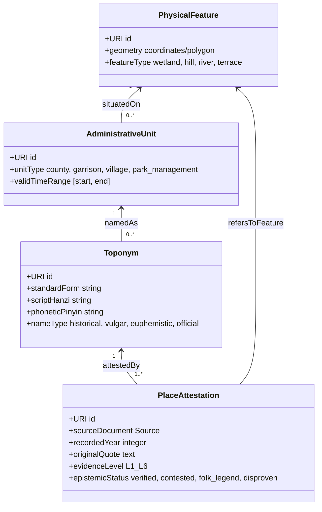

# 海淀历史地名知识图谱本体设计规范（Haidian Historical Toponym Ontology, HHTO）

> 状态：设计评审中（Superpowers Architectural Spec）
> 日期：2026-10-02
> 作者：topprismdata / claude assistant
> 动机：海淀区拥有从唐代羁縻州、辽金水利、元代通惠水运、明代卫所军屯与太监庄茔、清代三山五园与八旗营房，直至近现代科学城与高等学府的千年底层堆叠。传统关系数据库（如早期 CHGIS 时段表）与平面 GIS 无法处理「同名异地、异名同地、空间漂移、音转流变、雅化重塑、民间附会、多源存疑与证伪」。本项目构建一套学术严密、工程可落地、证据可溯源的历史地名本体与知识图谱系统。

---

## 1. 理论根基与国际/国内范式裁决

### 1.1 传统关系型 GIS 的根本局限
- **行记录扁平化**：传统 GIS 强制将地名绑定到单一几何要素 $(x, y)$，一旦发生更名、治所迁徙、管辖范围伸缩，只能新增记录或覆盖字段，导致实体身份（Identity）断裂。
- **倒载与伪连续性**：后世文献（如清代《日下旧闻考》《光绪顺天府志》）追述前代历史时常发生「以今名冠古地」或「倒载前代」，平面数据无法表达不同史料断代视角下的认知断裂。
- **单义化陷阱**：强迫历史学家在互斥假说中选定一个「标准答案」，抹杀了历史学认识论的多样性与存疑价值。

### 1.2 国际标准辨析与取舍
1. **CIDOC CRM (ISO 21127) 与 CRMgeo / CRMinf**：
   - *优势*：提供了严密的「事件中心（Event-Centric）」哲学（`E5 Event`）、时空体区分（`CRMgeo: Phenomenal Place` 物理现实 vs `Declarative Place` 行政宣告边界），以及假说论辩模型（`CRMinf`）。
   - *取舍*：完整 CIDOC CRM 体系庞大沉重（80+类、130+属性），直接用于地名检索和轻量可视化推理成本过高。**裁决：采用其核心哲学与轻量映射对齐，不硬套全部深层类继承。**
2. **Linked Places Format (LPF) 与 PLATO (Place Attestation Ontology, 2026 草案)**：
   - *优势*：明确将「书证凭证（Attestation）」提升为一等公民实体。地名不是一个绝对真理，而是一份份具体文献在具体时空的「用例（Asserted Usage）」。
   - *局限*：PLATO 偏重西方地名志，将「建置实体（Administrative Unit）」与「地表物理地点（Spatial Feature）」混同。在海淀这类兼有自然水体、皇家园林、八旗驻防营房与县域行政编户的复杂区域，必须将建置与物理地点解耦。

### 1.3 本本体的核心原则（HHTO 顶层法则）
- **核心分离原则（The Quadruple Separation）**：地名符号 $\neq$ 物理空间 $\neq$ 建制实体 $\neq$ 史料书证。
- **事件驱动生命周期（Event-Driven Lifecycle）**：一切地名状态变更（创设、音转、雅化、废止、迁徙）均通过「事件实体」表达。
- **认识论与证据分层（Epistemological Stratification）**：区分事实、学说、传说与证伪，支持多假说并存。

---

## 2. 本体概念核心四分法（The Quadruple Separation）



1. **物理空间地物实体（`hhto:PhysicalFeature`）**：
   - 客观地理现实与自然空间底座（如万泉河道、瓮山、西山山麓、海淀湖沼浅滩）。
   - 具备相对稳定的物理坐标、水文高程或地理范围。
2. **建置与功能实体（`hhto:AdministrativeUnit`）**：
   - 制度性、行政性或社群功能性存在（如元代宛平县、清雍正圆明园护军营正白旗营房、蓝靛厂外火器营、1988北京市新技术产业开发试验区）。
   - 具有明确的职能、建制层级、管辖边界与制度存续区间。
3. **地名称号实体（`hhto:Toponym`）**：
   - 语言符号与社会称谓（如「海店」、「海甸」、「海淀」；「穷八家」、「大有庄」；「牛栏庄」、「柳浪庄」、「六郎庄」）。
   - 具有汉字字形、读音、词源类型（土语俗名、官方赐名、雅化名、借用名）。
4. **史料书证实体（`hhto:PlaceAttestation`）**：
   - 某文献、碑刻、档案在某年对该地名的一次具体记录。
   - 包含：引文、出处卷帙、记录年代、记录主体、证据层级。

---

## 3. 地名生命周期与演变事件模型（Toponym Lifecycle Events）

任何地名从产生、流变到消失，均由具体的历史事件触发。定义 `hhto:ToponymEvent` 体系：

### 3.1 事件分类模型
| 事件类 (`hhto:Class`) | 语义定义 | 海淀历史典型实例 |
|---|---|---|
| `CreationEvent` | 聚落成村、工程创设、初次得名 | 元代通惠河广源闸始建（1292）；清雍正二年八旗营房设立（1724） |
| `ImperialNamingEvent` | 帝王或官方赐名改名 | 乾隆嫌「穷八家」不吉利赐名「大有庄」；为母祝寿建「苏州街」 |
| `PhoneticShiftEvent` | 方言土音流变、同音通假俗写 | 「畏吾村」$\rightarrow$「畏兀儿村」$\rightarrow$「魏公村」；「灶君庙」$\rightarrow$「皂君庙」 |
| `EuphemisticRenamingEvent` | 避嫌恶、文人雅化重塑 | 「中官村」（太监墓地）$\rightarrow$「中关村」；「牛栏庄」$\rightarrow$「柳浪庄」 |
| `FolkAppropriationEvent` | 民间英雄传说附会改名 | 「柳浪庄」附会杨家将挂甲征辽演变为「六郎庄」；「百望山」附会佘太君望儿 |
| `AdministrativeShiftEvent` | 政区调整、治所迁徙、升降并撤 | 宛平县分治；香山健锐营八旗分翼；1950年代中关村科学园区划定 |
| `SpatialExtinctionEvent` | 实体消失但地名符号存续（地名化石） | 「成府村」在城市化中拆除，留「成府路」；清末「蓝靛厂」染坊全歇，街名仍存 |

### 3.2 演变对象属性关系
- `hhto:hasPredecessor` / `hhto:hasSuccessor`：前后承袭关系。
- `hhto:phoneticShiftFrom`：音转来源。
- `hhto:euphemismFrom`：雅化来源。
- `hhto:folkEtymologyOf`：传说附会自。
- `hhto:splitInto` / `hhto:mergedFrom`：拆分与合并。
- `hhto:persistsAs`：物理实体消亡后作为道路名/地标名存续。

---

## 4. 历史认识论与六级证据分层模型（Evidence Grading）

借鉴数字人文考证学规范与本项目红线纪律，建立本体内嵌的证据可信度与认识论状态：

```
Level 1 (考古硬证据)    ── 绝无伪托的出土实物、碳十四定年、古水闸木桩、铭文铜钟
Level 2 (一手官刻金石)  ── 同时代敕建碑刻、御制诗文石刻、内务府实录、红本奏折
Level 3 (正史方志纪实)  ── 《元史》《明史》《日下旧闻考》《光绪顺天府志》
Level 4 (近代学界考订)  ── 谭其骧、侯仁之、陈垣等现代历史地理学家严密考证成果
Level 5 (民间口碑传说)  ── 宗族家谱追述、乡土野史传说、杨家将/乾隆下江南传说
Level 6 (已被证伪伪说)  ── 经过档案与考证已明确排除的错误说法（标红线）
```

### 4.1 多假说并存模型（`hhto:CompetingHypothesis`）
当一个地名渊源存在学术争议时，知识图谱绝不下单一断语，而是构建假说节点：
- 每个假说（Hypothesis）指向独立的证据链（Attestation set）。
- 每个假说标注 `hhto:confidenceLevel`（高/中/低/存疑/已证伪）。
- 典型争议节点：
  - **太舟坞**：假说 A（唐神龙元年带州置清水店说，中等/存疑）；假说 B（元代白浮瓮山河漕运太州府码头说，方志文献支持）。
  - **中关村**：假说 A（陈垣先生1930s提议雅化说，民国口述）；假说 B（1913《京西图》已印制「中关村」，早于陈垣提议）。
  - **西三旗**：正假说（明代军屯小旗编号，一手档案）；伪假说（满洲八旗三旗，明确证伪 `Disproven`）。

---

## 5. 形式化规范定义（OWL / Turtle 核心架构草案）

### 5.1 核心命名空间
```turtle
@prefix hhto: <http://history.haidian.gov.cn/ontology/> .
@prefix owl:  <http://www.w3.org/2002/07/owl#> .
@prefix rdf:  <http://www.w3.org/1999/02/22-rdf-syntax-ns#> .
@prefix rdfs: <http://www.w3.org/2000/01/rdf-schema#> .
@prefix xsd:  <http://www.w3.org/2001/XMLSchema#> .
@prefix crm:  <http://www.cidoc-crm.org/cidoc-crm/> .
@prefix time: <http://www.w3.org/2006/time#> .
```

### 5.2 核心类结构（Classes）
1. `hhto:HistoricalEntity`（基类）
   - `hhto:PhysicalFeature`（物理地理实体）
     - `hhto:Watercourse`（水系河道）
     - `hhto:HydraulicFacility`（水闸水堰水柜）
     - `hhto:TerrainElevation`（山峦台地）
   - `hhto:AdministrativeUnit`（建置制度实体）
     - `hhto:Settlement`（自然村落/市镇）
     - `hhto:MilitaryGarrison`（军屯卫所/八旗营房）
     - `hhto:ImperialGarden`（皇家园林）
     - `hhto:ReligiousSite`（寺观宫观）
     - `hhto:BurialGround`（陵寝墓葬）
     - `hhto:ModernInstitution`（近现代科研学府）
   - `hhto:Toponym`（地名符号实体）
   - `hhto:PlaceAttestation`（史料书证用例实体）
   - `hhto:HistoricalEvent`（历史事件）
     - `hhto:ToponymEvolutionEvent`（地名演变事件）
   - `hhto:SourceDocument`（史料文献出处）
   - `hhto:Hypothesis`（学术考证假说）

### 5.3 核心对象属性（Object Properties）
- `hhto:hasCurrentName` $\rightarrow$ `Toponym`
- `hhto:hasHistoricalName` $\rightarrow$ `Toponym`
- `hhto:attestedIn` $\rightarrow$ `PlaceAttestation`
- `hhto:fromSource` $\rightarrow$ `SourceDocument`
- `hhto:evolutionTriggeredBy` $\rightarrow$ `ToponymEvolutionEvent`
- `hhto:evolvedFrom` $\rightarrow$ `Toponym`
- `hhto:competesWith` $\rightarrow$ `Hypothesis`
- `hhto:supportedBy` $\rightarrow$ `PlaceAttestation`
- `hhto:disprovenBy` $\rightarrow$ `PlaceAttestation`
- `hhto:locatedAtFeature` $\rightarrow$ `PhysicalFeature`

---

## 6. 典型三元组实例展示

### 6.1 实例一：六郎庄的演变链条与民间附会解构
```turtle
# 物理空间实体
hhto:feat_liulangzhuang a hhto:PhysicalFeature ;
    rdfs:label "海淀西南部万泉河水网台地" ;
    hhto:featureType "WetlandTerrace" .

# 地名演变：牛栏庄（明代） -> 柳浪庄（清代雅化） -> 六郎庄（民间附会）
hhto:top_niulanzhuang a hhto:Toponym ;
    rdfs:label "牛栏庄" ;
    hhto:nameEtymology "源于明代宛平官马牛羊放牧栏舍" .

hhto:top_liulangzhuang_willow a hhto:Toponym ;
    rdfs:label "柳浪庄" ;
    hhto:nameEtymology "清初康熙因万泉河垂柳成浪雅化改称" .

hhto:top_liulangzhuang_general a hhto:Toponym ;
    rdfs:label "六郎庄" ;
    hhto:nameEtymology "民间附会宋辽杨六郎驻军传说，谐音改字" .

# 演变事件
hhto:evt_rename_willow a hhto:EuphemisticRenamingEvent ;
    rdfs:label "牛栏庄雅化为柳浪庄" ;
    hhto:sourceToponym hhto:top_niulanzhuang ;
    hhto:targetToponym hhto:top_liulangzhuang_willow ;
    hhto:hasTimeRange "清初康熙年间" .

hhto:evt_folk_six a hhto:FolkAppropriationEvent ;
    rdfs:label "柳浪庄附会为六郎庄" ;
    hhto:sourceToponym hhto:top_liulangzhuang_willow ;
    hhto:targetToponym hhto:top_liulangzhuang_general ;
    hhto:evidenceLevel "Level 5 (民间传说)" ;
    hhto:disprovenAssertion "杨六郎从未在此筑庄驻兵" .
```

### 6.2 实例二：王恽《中堂事记》首见海店书证
```turtle
hhto:attest_haidian_1260 a hhto:PlaceAttestation ;
    rdfs:label "中堂事记之海店用例" ;
    hhto:attestedName "海店" ;
    hhto:recordedYear 1260 ;
    hhto:dynasty "元初（中统元年）" ;
    hhto:sourceDocument hhto:src_zhongtang_shiji ;
    hhto:originalQuote "六日丁卯，午憩海店，距京城廿里" ;
    hhto:evidenceLevel "Level 2 (一手元代官人文集)" ;
    hhto:significance "海淀区得名之文献最早确证" .
```

---

## 7. 交付产物与验证体系

1. **本体定义规范**：`haidian_ontology.ttl`（完整 OWL/Turtle 形式化定义，可由 rdflib / Protégé 加载）。
2. **实例知识图谱库**：覆盖全海淀 50+ 核心历史地名、6 个历史地层、200+ 演变事件与书证凭证。
3. **图谱一致性与负控制测试**：
   - 验证无孤立地名节点；
   - 验证每一条演变事件必有前后地名实体；
   - 负控制测试：断言已被证伪的地名（如西三旗源自八旗）必须且只能挂接 `Level 6 / Disproven` 标签，禁止进入正史事实链。
4. **离线交互式可视化工具**：基于 D3.js 的时间滑块力导向图，支持按朝代（唐/辽金/元/明/清/近现代）切片浏览地名演变网络与证据链。
